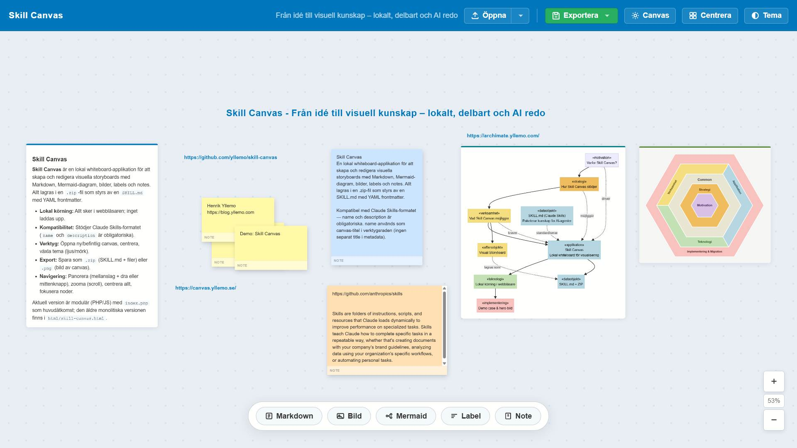

# Skill Canvas - Från idé till visuell kunskap - lokalt, delbart och AI redo



## Skill Canvas

En lokal whiteboard-applikation för att skapa och redigera visuella storyboards med Markdown, Mermaid-diagram, bilder, labels och notes. Allt lagras i en .zip-fil som styrs av en SKILL.md med YAML frontmatter.

Kompatibel med Claude Skills-formatet — name och description är obligatoriska. name används som canvas-titel i verktygsraden (ingen separat title i metadata).

---

## Kom igång

1. Kör appen via PHP (t.ex. `php -S localhost:8080` i projektroten) och öppna `index.php`
2. **Öppna** en befintlig `.zip`, dra den till fönstret, eller välj **Ny tom canvas** via öppna-menyn
3. Fyll i skill-metadata (`name`, `description`, …) vid ny canvas
4. Lägg till noder via toolbaren längst ner
5. **Exportera** som `.zip` (eller `Ctrl+S`) — eller som `.png` för en bild av canvasen

Allt sker lokalt i webbläsaren; inget laddas upp.

> **Legacy:** `html/skill-canvas.html` är en äldre monolitisk version. Den aktiva appen är `index.php` med modulär PHP/JS-struktur.

---

## Verktygsrad

| Element | Funktion |
|---------|----------|
| **Titel** (`name`) | Klicka för att öppna skill-metadata. Beskrivningen (`description`) visas som underrad. |
| **Öppna** ▾ | Klick = filväljare. Pil = meny: *Öppna .zip-fil* / *Ny tom canvas* |
| **Exportera** ▾ | *Spara .zip* (SKILL.md + filer) eller *Spara .png* (bild av alla objekt) |
| **Canvas** | Öppna skill-metadata |
| **Centrera** | Zooma ut så att alla noder syns |
| **Tema** | Växla ljust/mörkt läge |

Exportfiler namnges automatiskt:

```
my-skill_2026-05-31_14.30.45.zip
my-skill_2026-05-31_14.30.45.png
```

---

## Navigera på canvas

| Åtgärd | Hur |
|--------|-----|
| Panorera | `Mellanslag + dra` eller mittenmusknapp |
| Zooma | Scrollhjul |
| Centrera allt | **Centrera** |
| Fokusera en nod | Dubbelklick på handtaget, eller fokus-ikonen (ej Notes) |
| Markera nod | Klick |
| Flytta nod | Dra i handtaget (Markdown, Mermaid, Bild) — eller direkt på ytan (Label, Note) |
| Ändra storlek | Resize-hörn nere till höger (Notes: bredd och höjd) |
| Kontextmeny | Högerklick på nod |
| Ta bort markerad | `Delete` / `Backspace` |
| Duplicera markerad | `Ctrl+D` |
| Spara .zip | `Ctrl+S` |

Handtaget på Markdown, Mermaid och Bild ligger i dokumentflödet (trycker inte ner innehållet ovanpå text/diagram vid hover).

---

## Nodtyper

### Markdown
Full Markdown-support: rubriker, listor, tabeller, kodblock, citat, länkar. Innehåll sparas som `.md` under `nodes/`.

- **Fullskärmseditor** — grön knapp nere till vänster i redigeringsmodalen öppnar Monaco-editor (`html/markdown.php`) i iframe med `postMessage`-sparande.

### Mermaid
Diagram med [Mermaid](https://mermaid.js.org/)-syntax. Kod sparas som `.mmd` under `diagrams/`.

- **Mermaid Live** — grön knapp i redigeringsmodalen öppnar [mermaid.live](https://mermaid.live/) i ny flik.

### Bild
Uppladdning, extern URL eller **Ctrl+V** (klistra in från urklipp). Lokala bilder sparas under `images/` med tidsstämpel i filnamnet (`YYYY-MM-DD_HH.mm.ss.png`). Caption och alt-text stöds.

### Label
Fri text direkt på canvas — ingen kortyta. Teckenstorlek och färg väljs i modal. Dra genom att greppa texten.

### Note
Post-it-liknande kort med inline-redigering (`contenteditable`). Ingen redigeringsmodal — skriv direkt på kortet.

- Sex färger (välj vid skapande eller via färgknappar i nedre verktygsraden vid hover)
- Flytta via nedre verktygsraden (grab-cursor)
- Ändra bredd och höjd via resize-hörn
- Ingen fokus-zoom (övriga nodtyper har det)

---

## Projektstruktur

```
skill-canvas/
├── index.php              ← huvudapp
├── app.js                 ← canvas, zoom, export, noder
├── style.css
├── favicon.svg
├── config/
│   ├── app.php            ← apptitel, språk, tema, favicon
│   └── defaults.php       ← standardvärden för skill, canvas, nodtyper, moduler
├── includes/              ← bootstrap, modul-laddare, hjälpfunktioner
├── modules/               ← PHP: modal-HTML per nodtyp
├── js/
│   ├── modal.js
│   └── modules/           ← JS: add/edit/render per nodtyp
├── api/modal.php          ← returnerar modal-HTML som JSON
└── html/
    └── markdown.php       ← fullskärmseditor (Monaco)
```

Nya nodtyper läggs till som par av `modules/<slug>.php` + `js/modules/<slug>.js`, registrerade via `ModuleRegistry`.

---

## SKILL.md-format

Varje `.zip` måste innehålla `SKILL.md` med YAML frontmatter. Övriga filer i zip:en refereras via `file`-fält i noderna.

### Metadata

```yaml
---
name: my-skill
description: Summarizes uncommitted changes and flags anything risky. Use when the user asks what changed.
author: ''
version: '1.0'
tags:
  - klos
  - bas

nodes:
  # ... se nodschema nedan
---
```

| Fält | Typ | Beskrivning |
|------|-----|-------------|
| `name` | sträng | **Obligatorisk.** Skill-id, canvas-titel och bas för exportfilnamn |
| `description` | sträng | **Obligatorisk.** När/hur skillen ska användas |
| `author` | sträng | Valfri |
| `version` | sträng | Valfri, standard `1.0` |
| `tags` | lista | Valfria sökbara taggar |

Vid import av äldre zip-filer med `title` (utan `name`) används `title` som `name`.

### Gemensamt nodschema

| Fält | Typ | Beskrivning |
|------|-----|-------------|
| `id` | sträng | Unikt ID, genereras automatiskt |
| `type` | sträng | `markdown` \| `mermaid` \| `image` \| `label` \| `note` |
| `x`, `y` | heltal | Position i px |
| `width` | heltal | Bredd i px |
| `height` | heltal | Höjd i px (Notes) |

### Markdown

```yaml
- id: n001
  type: markdown
  x: 80
  y: 200
  width: 420
  title: "Visas i handtaget"        # valfri
  file: nodes/n001.md               # rekommenderat
```

### Mermaid

```yaml
- id: n002
  type: mermaid
  x: 540
  y: 200
  width: 500
  title: "Systemlandskap"
  file: diagrams/n002.mmd
```

### Bild

```yaml
- id: n003
  type: image
  x: 80
  y: 600
  width: 400
  file: images/2026-05-31_14.30.45.png
  caption: "Bildtext"
  alt: "Beskrivning"
```

### Label

```yaml
- id: n004
  type: label
  x: 80
  y: 60
  content: "GT Domänarkitektur"
  fontSize: 38
  color: "#0077bc"
```

### Note

```yaml
- id: n005
  type: note
  x: 200
  y: 400
  width: 220
  height: 160
  color: "#fff9a8"
  content: "Skriv här…"
```

---

## Zip-struktur

```
my-skill.zip
├── SKILL.md
├── nodes/
│   └── n001.md
├── diagrams/
│   └── n002.mmd
└── images/
    └── 2026-05-31_14.30.45.png
```

Mappnamn följer konventioner i `config/defaults.php` men styrs i praktiken av `file`-sökvägar i noderna.

---

## Konfiguration

Standardvärden i `config/defaults.php` kan justeras utan kodändring:

- **canvas** — zoom-gränser, marginaler vid centrering/fokus
- **nodes.\*** — standardbredd, min/max per nodtyp
- **modules.\*** — modaltexter, placeholders, note-färger, editor-URL:er

Apptitel, språk och favicon: `config/app.php`.

---

## Design

Bygger på Göteborgs Stads grafiska profil (`#0077bc`). Ljust och mörkt tema. Favicon: `favicon.svg`.

CDN-bibliotek: Mermaid, marked, JSZip, js-yaml, html2canvas (PNG-export), Monaco Editor (markdown fullskärm).

---

## Kompatibilitet

Testad i Chrome 120+, Edge 120+, Firefox 121+.

- **PHP-app:** kräver webbserver (PHP inbyggd server räcker)
- **All data lokalt** — zip/png laddas ner till disk, inget skickas externt
- PNG-export renderar en klon av noderna off-screen via html2canvas (2× upplösning)
